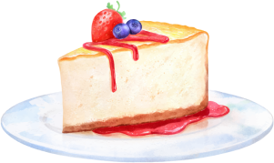

Cheesecake de Frutas Recipe

# Cheesecake de Frutas Recipe

This repository contains a delicious recipe for Cheesecake de Frutas. The combination of sweet strawberries and slightly tart blueberries creates a fresh and balanced dessert. The creamy texture of the cheesecake perfectly complements the crunchy biscuit base. If you're looking for an easy-to-make dessert that will impress your guests, this is the ideal recipe.

This repository contains a delicious recipe for Cheesecake de Frutas. The combination of sweet strawberries and slightly tart blueberries creates a fresh and balanced dessert. The creamy texture of the cheesecake perfectly complements the crunchy biscuit base. If you're looking for an easy-to-make dessert that will impress your guests, this is the ideal recipe.

Table of Contents
Ingredients
Instructions
Contributing
License
Ingredients
200g of maisena biscuits
100g of butter, melted
300g of cream cheese
1 can of sweetened condensed milk
1/2 cup of lemon juice
1 tablespoon of unflavored gelatin
1 cup of blueberries
Instructions
Crush the biscuits and mix them with the melted butter.
Line a baking dish with the biscuit mixture and refrigerate.
In a bowl, beat the cream cheese, sweetened condensed milk, and lemon juice.
Dissolve the gelatin and add it to the cream cheese mixture.
Pour the cream cheese mixture over the biscuit base and refrigerate for 2 hours.
Top the cheesecake with blueberries before serving.
Contributing
If you have any suggestions, improvements, or find any issues with the recipe, please feel free to open an issue or a pull request.

License
This project is licensed under the MIT License.

Replace the placeholder image link "assets/image1.png" with the actual link to your image file. You can also add more sections to the readme if you have other information related to the project.

Remember, a readme file should be included in the root directory of your project and written in markdown format (README.md). It is essential for providing guidance to others who want to use or contribute to your project.

